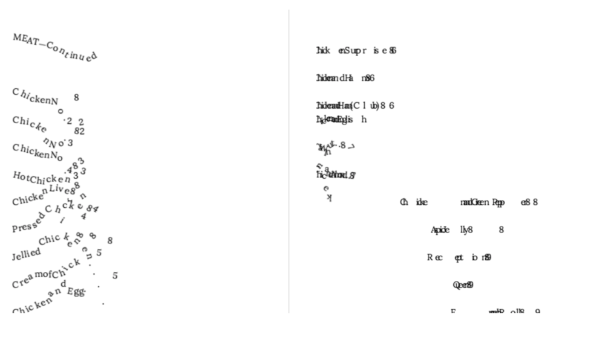
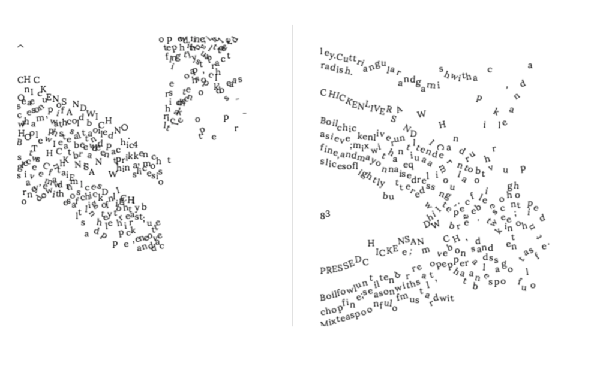
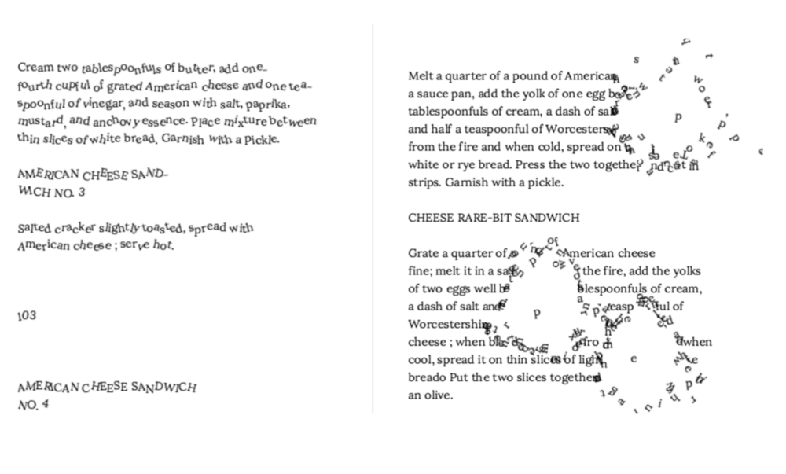

# A Physical Book
### For <a href="https://github.com/NaNoGenMo/2017">National Novel Generation Month 2017</a>
Liza Daly

_A Physical Book_ makes a digitized book “physical” by rendering it in a simulated space where properties like gravity, friction, and velocity all apply. The program randomly perturbs the letters, then takes a snapshot at a point in time, re-assembling the images into a new, “un-digitized” book.

<a href="https://lizadaly.com/projects/a-physical-book/">Live demo</a>

The raw, uncorrected scanned text of _<a href="https://publicdomainreview.org/collections/the-up-to-date-sandwich-book-400-ways-to-make-a-sandwich-1909/">The Up-To-Date Sandwich Book: 400 Ways to Make a Sandwich (1909)</a>_ is re-imagined as this 251 page (50,964 words) book:

### Implementation
_A Physical Book_ uses the web-based game engine <a href="https://phaser.io">Phaser</a>. Each page of the book is rendered into an invisible `
` (to produce correct leading and line-height), then copied into the Phaser game world with each letter instantiated as a distinct addressable sprite.

For each page, one of a dozen transformations is applied to give the text varying physical properties, such as mass, acceleration, collision, or opacity.

On page load, the requested chapter number is rendered, the transformation is assigned, and the world is allowed to run. A Selenium wrapper script calls all 500 pages in succession, taking a screenshot at a random point in the animation:

The final book is rendered in a two-page spread PDF.

<a href="nanogenmo2017-lizadaly-small.pdf">Small 30 page sample</a>.

<a href="https://www.dropbox.com/s/lphwafia5qskokt/nanogenmo2017-lizadaly.pdf?dl=0">Full 50,000+ word, 250 page PDF</a> (55MB)

In a hilarious bit of recursion, it is also being hosted on <a href="https://archive.org/details/a_physical_book_liza_daly">The Internet Archive</a>, where the book scan originated.
