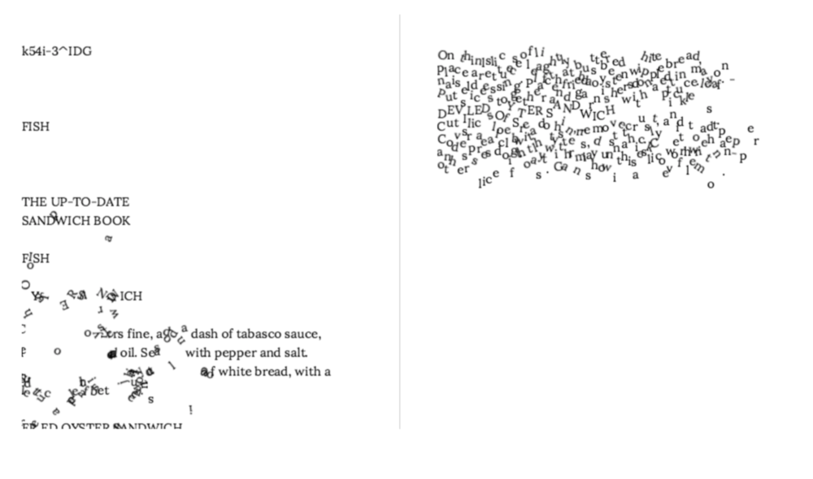
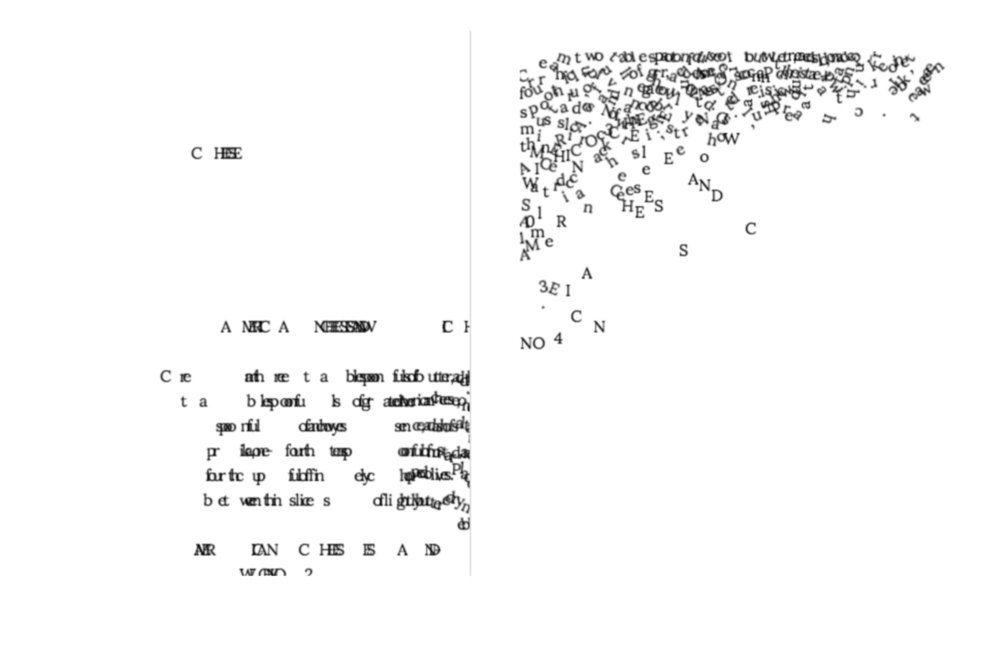
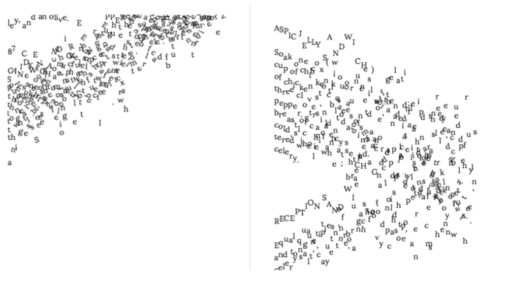
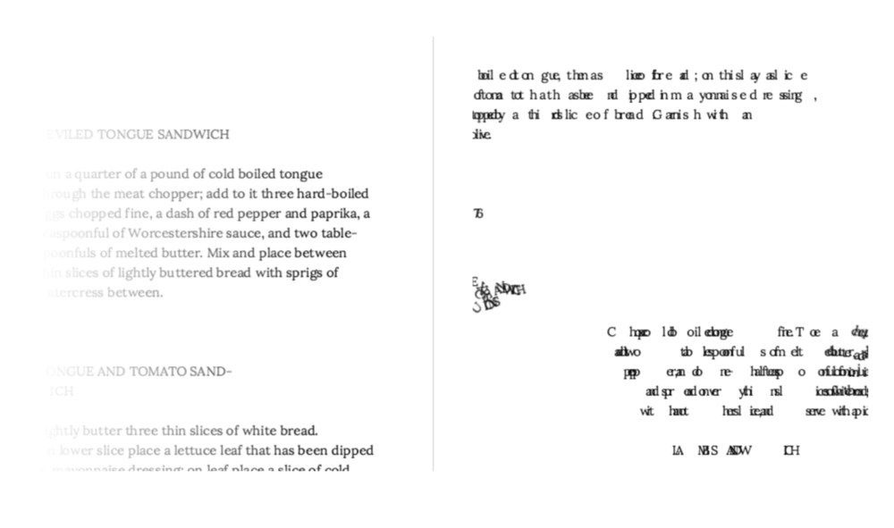

# A Physical Book
### For National Novel Generation Month 2017
Liza Daly

_A Physical Book_ makes a digitized book “physical” by rendering it in a simulated space with properties like gravity, friction, and velocity, then randomly perturbing one or more of the letters.

The raw, uncorrected scanned text of _<a href="https://publicdomainreview.org/collections/the-up-to-date-sandwich-book-400-ways-to-make-a-sandwich-1909/">The Up-To-Date Sandwich Book: 400 Ways to Make a Sandwich (1909)</a>_ is first rendered in a browser window, then one of a dozen random transformations is applied to it. The final “book” is 251 pages (50,964 words) of facing pages following the order of the original text.

### Implementation
_A Physical Book_ uses the web-based game engine <a href="https://phaser.io">Phaser</a>. Each page of the book is rendered into an invisible `
` (to produce correct leading and line-height), then copied letter-by-letter into the Phaser game world.

For each page, one of a dozen transformations is applied to give the text varying physical properties, such as mass, acceleration, collision, or opacity.

On page load, the requested chapter number is rendered and the animation is run. A Selenium wrapper script calls all 500 chapters in succession, taking a screenshot at a random point in the animation:

The final book is rendered in a two-page spread PDF.

<a href="nanogenmo2017-lizadaly-small.pdf">Small 30 page sample</a>.

<a href="https://www.dropbox.com/s/lphwafia5qskokt/nanogenmo2017-lizadaly.pdf?dl=0">Full 50,000+ word, 250 page PDF</a> (55MB)
